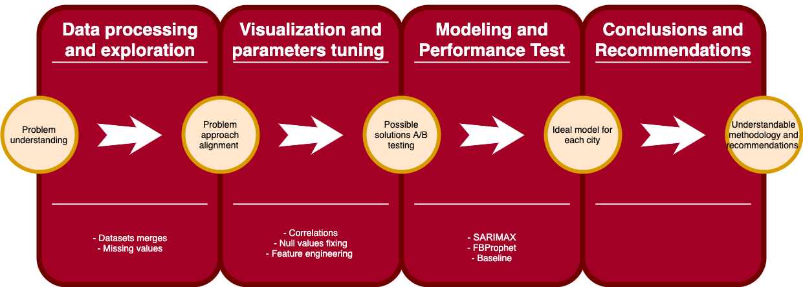

# Predicting the Next Pandemic of Dengue
#### by Brenda Hali

----
## Problem Statement

Dengue is a mosquito-borne viral infection that has spread throughout the tropical world over the past 60 years and now affects over half the world’s population. In its less severe form infected patients will experience flu-like symptoms that vary from mild to intense, but severe dengue or, Dengue Hemorrhagic Fever, can be fatal without proper medical care.  The geographical range of dengue is expected to further expand due to ongoing global phenomena including climate change and urbanization.

The Centers for Disease Control (CDC) estimates one third of the world population is exposed to the dengue virus and is at risk of contracting the disease. According to the CDC “As many as 400 million people are infected yearly.” The World Mosquito Program states that “500,000 cases develop into dengue hemorrhagic fever… which results in up to 25,000 deaths annually worldwide.”  The World Health Organization (WHO) in their publication “Global strategy for dengue prevention and control 2012-2020” asserts that “Dengue morbidity can be reduced by implementing improved outbreak prediction and detection through coordinated epidemiological and entomological surveillance”.

A large number of studies have confirmed that the incidence of dengue is positively correlated with climatic conditions, specifically, temperature, humidity and precipitation levels. Many of these studies include quantitative models correlating climate variables with the incidence of dengue cases.

Looking to answer the question: How well would we be able to predict future cases of the disease based on climate variables that are included in weather forecasts? Several departments of the U.S. Federal Government have joined efforts to create the Dengue Forecasting project, which makes climate and dengue data available to data scientists at large and challenges them to submit predictive models to help forecast future dengue epidemics.

Accurate dengue predictions would help public health workers, government, and people around the world take steps to reduce the impact of these epidemics.

### Project Goal

The goal is to answer the question: **How well would we be able to predict future cases of the disease based on climate variables that are included in weather forecasts?**

### Data Description

- **Dengue data.** Historical surveillance data was provided for two endemic locations: Iquitos, Peru and San Juan, Puerto Rico. The data include weekly laboratory-confirmed and serotype-specific cases for each location.

- **Other data.** Environmental data from weather stations, satellites, and climate models are also provided along with relevant metadata.

- **Temporal range.** Data corresponds to two time periods at each location, a training period and a testing time period. The initial data only covers the training period, 1990-2009 for San Juan and 2000-2009 for Iquitos. Testing data for 2009- 2013.

#### Data Dictionary

#### Abreviations

|Value | Description|
|---:| :---| 
|sj | San Juan, Puerto Rico|
|iq | Iquitos, Peru|

#### Date Format
|Value | Description|
| ---:| :---| 
|week_start_date |  yyyy-mm-dd format|

#### Data Descriptions

|Value |Description|Source|
|:---|:---|:---|
|ndvi_se | Pixel southeast of city centroid| NOAA's CDR Satellite vegetation|
|ndvi_sw | Pixel southwest of city centroid|NOAA's CDR Satellite vegetation|
|ndvi_ne | Pixel northeast of city centroid|NOAA's CDR Satellite vegetation|
|ndvi_nw |Pixel northwest of city centroid|NOAA's CDR Satellite vegetation|
|precipitation_amt_mm | Total precipitation| PERSIANN satellite|
|reanalysis_sat_precip_amt_mm|Total precipitation|NOAA's NCEP Climate Forecast|
|reanalysis_dew_point_temp_k |Mean dew point temperature|NOAA's NCEP Climate Forecast|
|reanalysis_air_temp_k | Mean air temperature|NOAA's NCEP Climate Forecast|
|reanalysis_relative_humidity_percent |Mean relative humidity|NOAA's NCEP Climate Forecast|
|reanalysis_specific_humidity_g_per_kg| Mean specific humidity|NOAA's NCEP Climate Forecast|
|reanalysis_precip_amt_kg_per_m2 | Total precipitation|NOAA's NCEP Climate Forecast|
|reanalysis_max_air_temp_k | Maximum air temperature|NOAA's NCEP Climate Forecast|
|reanalysis_min_air_temp_k | Minimum air temperature|NOAA's NCEP Climate Forecast|
|reanalysis_avg_temp_k | Average air temperature|NOAA's NCEP Climate Forecast|
|reanalysis_tdtr_k | Diurnal temperature range|NOAA's NCEP Climate Forecast|
|station_max_temp_c |Maximum temperature|NOAA's GHCN daily climate data |
|station_min_temp_c | Minimum temperature|NOAA's GHCN daily climate data|
|station_avg_temp_c | Average temperature|NOAA's GHCN daily climate data|
|station_precip_mm | Total precipitation|NOAA's GHCN daily climate data|
|station_diur_temp_rng_c | Diurnal temperature range|NOAA's GHCN daily climate data|

#### Data Source Description

- PERSIANN satellite precipitation measurements 0.25x0.25 degree scale)

- NOAA's GHCN daily climate data weather station measurements

- NOAA's NCEP Climate Forecast System Reanalysis measurements (0.5x0.5 degree scale)

- Satellite vegetation - Normalized difference vegetation index (NDVI) - NOAA's CDR Normalized 

- Difference Vegetation Index (0.5x0.5 degree scale) measurements

Metadata Furter explanation: <https://dengueforecasting.noaa.gov/docs/Metadata.pdf>

--- 

### Methodology

The project follows a typical Machine Learning Process:

1. Obtain data
2. Perform exploratory data analysis
3. Choose a learning model
4. Preprocess	the data for machine learning	model (feature	engineering)
5. Tune the model
6. Run	the model on the test dataset
7. Capture predictions
8. Iterate for better results

#### Performance Metric and Evaluation

Mean absolute error (MAE) is the mean absolute difference between predictions yˆ and observations y over n data points:

#### Modeling Process

To model the data, a simple baseline model, FBProphet and SARIMAX models were used.

FB Prophet was the model that performed better with the following results:

## Conclusions  
"This week" weather is not important. Mosquitoes reproduce better in warm, humid weather. Eggs take from 4 to 6 weeks to hatch. And from 4 to 8 months for the first cases to appear.
Right now, given that there is not enough organized data, dengue is still difficult to predict and prevent accurately
Hyperparameters and feature engineering matter!

### Next Steps
Make with more data, create a model that is useful anywhere in the world.
Connect it with a dynamic database for ‘live’ results.

### Computational resources:
To run properly the project you can refer to the `0-Installs` notebook located in the `2-Code` f. older

#### References and external resources:

Dengue Forecasting Project: https://dengueforecasting.noaa.gov/docs/project_description.pdf

Data Driven Competition: https://www.drivendata.org/competitions/44/dengai-predicting-disease-spread/page/82/

Auto regression models forecasting in Python:
https://machinelearningmastery.com/autoregression-models-time-series-forecasting-python/

AMIRA Model: https://alkaline-ml.com/pmdarima/tips_and_tricks.html

Dengue Forecasting Project: https://dengueforecasting.noaa.gov/docs/project_description.pdf
